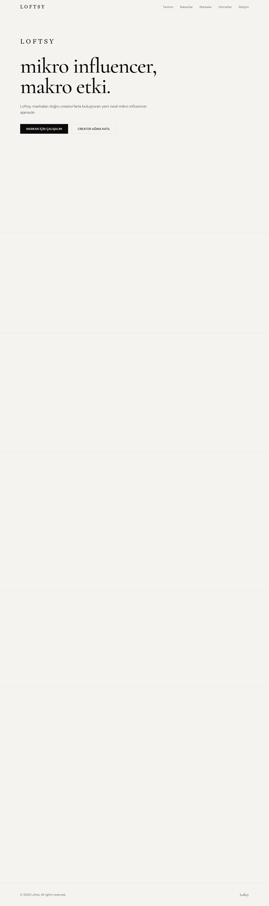

# Loftsy Website

Single-page marketing site for Loftsy — a premium micro-influencer agency. Built with Vue 3, Vite, Vue Router, and Tailwind CSS v4.



## Stack

- **Vue 3** (Composition API, SFC)
- **Vite**
- **Vue Router**
- **Tailwind CSS v4**
- **Vercel** (static hosting + optional serverless contact API)

## Local Development

```bash
npm install
npm run dev
```

Open [http://localhost:5173](http://localhost:5173).

Build for production:

```bash
npm run build
npm run preview
```

## Configuration

All site content and contact channels are managed from a single file:

[`src/config/site.config.ts`](src/config/site.config.ts)

Edit this file to update copy, navigation, brands, services, stats, and contact options. No component changes are required for most updates.

### Content sections

| Section | Config key | Description |
|---------|------------|-------------|
| Hero | `hero` | Headline, subtext, CTA buttons |
| Intro | `intro.text` | Short agency description |
| Stats | `stats[]` | Value + label pairs |
| Brands | `brands` | Title and brand list |
| Services | `services` | Title and service cards |
| Closing CTA | `cta` | Final call-to-action block |
| Navigation | `nav[]` | Header anchor links |
| Footer | `footer.copyright` | Footer text |

### Brand logos

Brands are text by default. To add a logo later, set `logoUrl` on any brand item:

```ts
brands: {
  title: 'trusted by brands',
  items: [
    { name: 'Dimes', logoUrl: '/brands/dimes.svg' },
    { name: 'A101' },
  ],
},
```

Place logo files in the `public/` folder.

### Contact channels (configurable)

Contact options are shown only when configured. Leave a field empty to hide that channel.

```ts
contact: {
  email: 'hello@loftsy.com',       // Shows "Send email" button (mailto)
  whatsapp: '905551234567',        // Shows WhatsApp button (digits only or +90 format)
  form: {
    enabled: true,                 // Shows contact form
    endpoint: '/api/contact',      // Vercel serverless endpoint
  },
  placeholderMessage: 'Contact channels coming soon.',
},
```

**Behavior:**

- `email` set → mailto link appears
- `whatsapp` set → WhatsApp link appears (`wa.me`)
- `form.enabled: true` → contact form appears and posts to `/api/contact`
- All empty/disabled → placeholder message is shown instead

### Logo

Replace [`src/assets/logo.svg`](src/assets/logo.svg) with the official Loftsy logo when available. Update [`public/favicon.svg`](public/favicon.svg) to match.

### SEO

Update meta tags in [`index.html`](index.html):

- `<title>`
- `<meta name="description">`
- Open Graph and Twitter tags

## Deploy to Vercel

### Option 1: Vercel Dashboard

1. Go to [vercel.com](https://vercel.com) and import the GitHub repository.
2. Framework preset: **Vite**
3. Build settings (defaults usually work):
   - **Build Command:** `npm run build`
   - **Output Directory:** `dist`
   - **Install Command:** `npm install`
4. Click **Deploy**.

The included [`vercel.json`](vercel.json) handles SPA routing so client-side navigation works on refresh.

### Option 2: Vercel CLI

```bash
npm install -g vercel
vercel login
vercel
```

Follow the prompts. For production:

```bash
vercel --prod
```

### Contact form on Vercel

If `contact.form.enabled` is `true`, configure these environment variables in the Vercel project settings:

| Variable | Description |
|----------|-------------|
| `CONTACT_EMAIL` | Recipient email address |
| `RESEND_API_KEY` | API key from [Resend](https://resend.com) |

The serverless handler lives at [`api/contact.ts`](api/contact.ts). It sends form submissions via Resend.

Without these env vars, the form UI still renders but submissions return a configuration error.

### Custom domain

1. Open the Vercel project → **Settings** → **Domains**
2. Add your domain (e.g. `loftsy.com`)
3. Update DNS records as shown by Vercel

## Project Structure

```
src/
├── config/site.config.ts    # Site content & contact config
├── components/
│   ├── layout/              # Header, footer
│   ├── sections/            # Page sections
│   └── ui/                  # Reusable UI primitives
├── composables/             # Contact config, scroll reveal helpers
├── views/HomeView.vue       # Single-page layout
└── styles/global.css        # Tailwind theme tokens
api/
└── contact.ts               # Vercel serverless contact handler
```

## Repository

[github.com/Buttercup-Technologies/loftsy-web](https://github.com/Buttercup-Technologies/loftsy-web)
